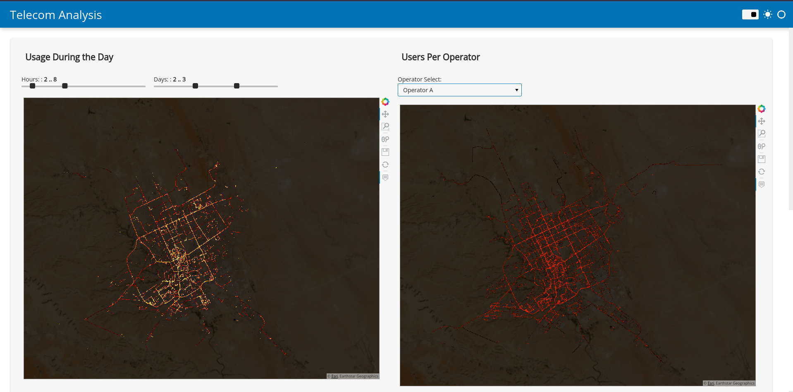
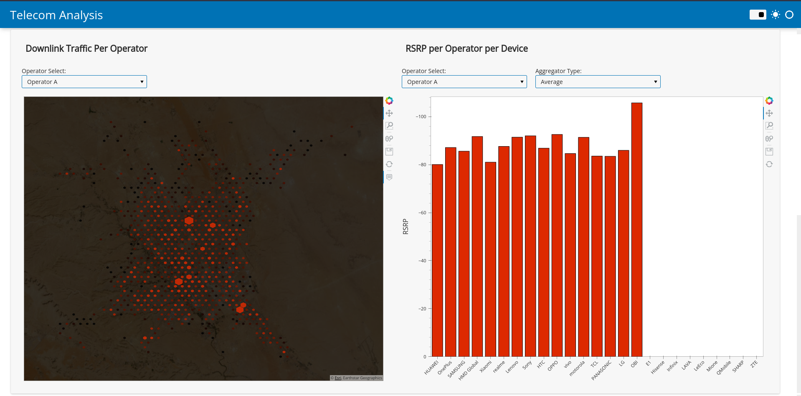

# AI in Telecom
This is an analysis of around 3 million time-series data points for the Telecom industry, to gain insights about the areas with high traffic or a high number of users. I also created a dashboard with four maps.
The Dashboard can be viewed by typing the following commands in the terminal:

```
cd Dashboard
panel serve --show Dashboard.py
```

The Dashboard consists of four plots and looks like this:



The libraries used during the creation of this projects:
- pandas
- numpy
- matplotlib 
- WordCloud (Used to create a wordcloud for the device manufacturers)
- holoviews (this is used to create the geomaps)
- colorcet (a library for polished color maps)
- datashader (This is used to plot these millions of points while preventing overplotting)
- bokeh (This is used to render our plots (as backend))
- fastparquet (This is a better format for a dataset, provides a smaller size and a fast read & write operations)

The rest is mentioned in the requirments.txt file